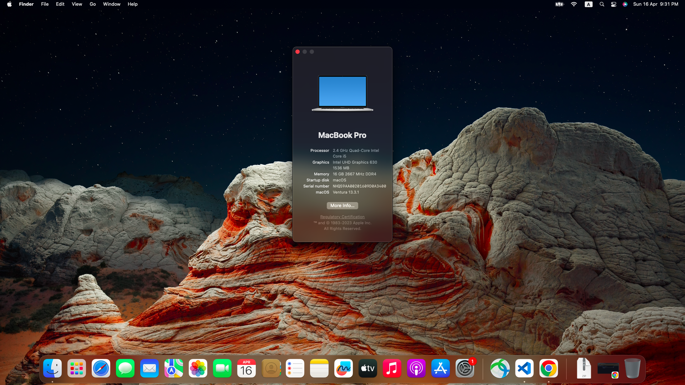

# acer-nitro-5-AN515-54-OC

macOS Ventura 13.3.1 on Acer Nitro 5 AN515-54 with OpenCore 0.9.1 EFI folder.

## Configuration

| Specifications      | Details                                             |
| ------------------- | --------------------------------------------------- |
| Laptop Model        | AN515-54 5812                                       |
| Processor           | Intel® Core™ i5-9300H                               |
| Graphics            | Intel® UHD Graphics 630 & Nvidia GeForce® GTX 1650  |
| RAM                 | 16GB DDR4-2666Mhz                                   |
| Disk (PCIe® NVMe™)  | KINGSTON SA2000M8500G & KINGSTON RBUSNS8154P3256GJ1 |
| Disk (SATA HDD)     | WDC WD10SPZX-22Z10T1                                |
| Audio               | Realtek HD Audio ALC255                             |
| Wifi                | Intel(R) Wireless-AC 9560 160MHz                    |
| Ethernet            | RealTek RTL8168/8111 PCI-E Gigabit Ethernet         |

## What's working

- [x] Audio (Input & Output)
- [x] iGPU
- [x] ACPI Display brightness
- [x] Ethernet
- [x] Sleep + Wake
- [x] Smart Touchpad + Gestures
- [x] WiFi (2.4Ghz and 5GHz)
- [x] Native hotkey support with Fn keys
- [x] iServices (Messages, FaceTime, etc.)

## What's not working

- [ ] GTX 1650 (macOS does not support recent Nvidia GPUs).
- [ ] HDMI port (since it's connected to the GTX 1650).
